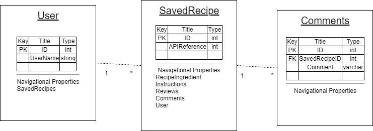

# Cookbook

## Schema

### Schema Description
- The user contains a Primary Key of ID(int), UserName(varchar), and dietary preference properties(bit). User has the navigational property of Saved Recipes. It has a one to many relationship with SavedRecipes. 
- SavedRecipes contains a Primary Key of ID(int) a Foreign Key of UserID(int) referencing the User table. It also contains dietary preferent properties(bool). It has navigational properties of User, Instructions, Reviews, Comments, and SavedRecipeIngredients. It has a many to one relationship with Users, a one to many relationship to Reviews, Comments, and SaveRecipeIngredients.
- Reviews has a Primary Key of ID(int) a foreign key of SavedRecipesID, and a Review(varchar). It has a navigational property of SavedRecipes and a many to one relationship with SavedRecipes. 
- Comments has a Primary Key of ID(int) a foreign key of SavedRecipesID, and a Comment(varchar). It has a navigational property of SavedRecipes and a many to one relationship with SavedRecipes. 
- Instructions has a Composite Key of StepNumber(int) and SavedRecipesId, and a Actiont(varchar). It has a navigational property of SavedRecipes and a many to one relationship with SavedRecipes. 
- SavedRecipesIngredients has a Composite Key made up of SavedRecipeID(int) and IngredientID(int). It also contains the property Quantity(varchar). It has navigational properties of SavedRecipes and Ingredients. It has a many to one relationship with both SavedRecipes and Ingredients. 
- Ingredients has a Primary Key of ID(int) and a property Name. It has a naviational property of SavedRecipeIngredients. It has a one to many relationship with SavedRecipeIngredients. 

