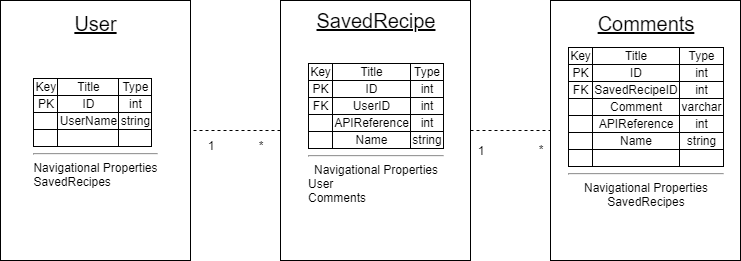

# Claire's Cookbook


## Technologies, Tools, and Libraries
### Languages
- C#
- CSS
- HTML
- SQL
### Libraries and Frameworks
- ASP.Net Core
- EntityFrameworkCore
- Cookbook API
### Tools
- Visual Studios.
- Azure Dev Ops
- Git
- Github
- Draw IO

## Cookbook API

Summary: The cookbook API is a open, RESTful API that contains recipes, including their instructions and ingredients. We used this API to search for recipes a user could save to their personal list of recipes.

## Set Up Instructions - Local Machine
- Fork the Cookbook repository.
- Open project in Visual Studios.
- Open user secrets. Establish a default connection of your local host. 
```
    "DefaultConnection": "Server=(localdb)\\MSSQLLocalDB;Database=CookbookWebApp;Trusted_Connection=True;MultipleActiveResultSets=True",
```
- Double check for any build errors.
- Open up your Package Management Console.
- Type text "Add-Migration" and hit enter.
- You will be prompted to add a name. This is semantic and be anything.
- Once migration has been added, type text "Update Database" and hit enter.
- You now have a database set up for your program.
- Run program with IIS Express.
- Note: The database is pre-seeded with several users. 


## User Instructions and Walkthrough
- Upon opening the web page for the first time, please select the link "My Profile" in the vertical nav bar.
- Enter in the username of your choice. If it is unique, it will redirect you to your user profile. If that name is already taken, you will be prompted to enter in another name.
- From the user page you may edit or delete your user, or log out. You will also be logged out if you close the window.
- To search for a recipe, enter a query into the search bar. If you leave the search bar blank, all available recipes will populate. You can search for new recipes from any page.
- After searching for a recipe, view details to see ingredients, instructions, and an image if available.
- On the details page, there is an option to save the recipe. If you chose to do so, it will be saved to your username.
- To view saved recipes, click the My Recipes link in the nav bar. This will show you a list of all your saved recipes. Select the details link to view the instructions and ingredients.
- When you view the details of a saved recipe, you will be given to option to add notes to your recipe, such as "great date night meal" or "cook an extra 15 minutes". These notes can be viewed from the recipe, or fromt he My Notes link on the nav bar.


## Schema


### Schema Description
- The user contains a Primary Key of ID(int), UserName(varchar). User has the navigational property of Saved Recipes. It has a one to many relationship with SavedRecipes. 
- SavedRecipes contains a Primary Key of ID(int) a Foreign Key of UserID(int) referencing the User table. It also contains a ApiRecipeID which is a reference to the Recipe inside the API. It has a one to many relationship with comments. 
- Comments has a Primary Key of ID(int) a foreign key of SavedRecipesID, and a Comment(varchar). It has a navigational property of SavedRecipes and a many to one relationship with SavedRecipes. 
